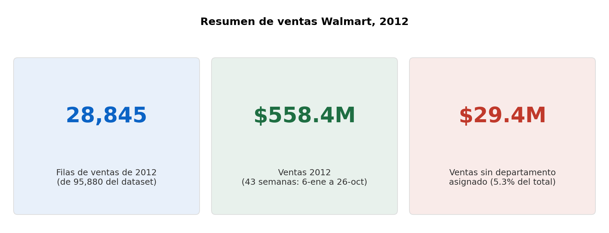
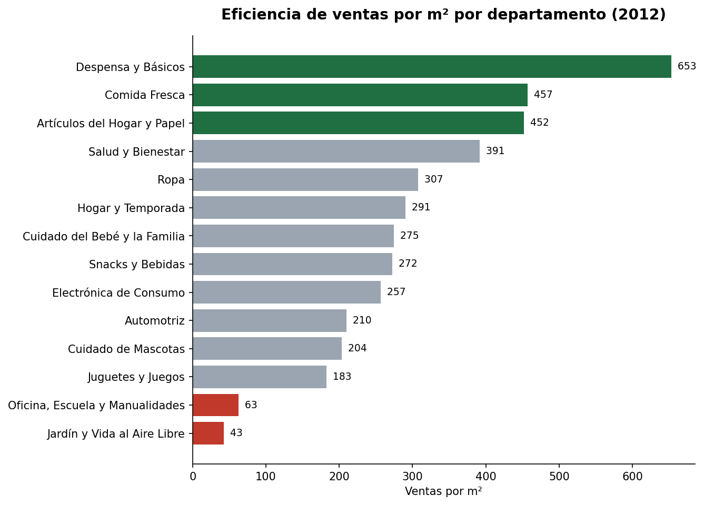
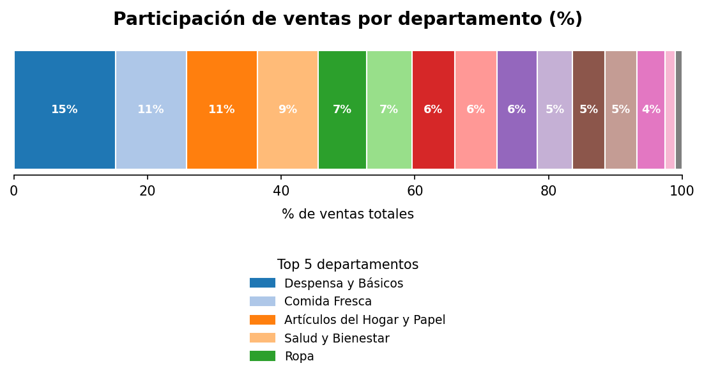

# 🛒 Eficiencia de ventas por departamento en Walmart (2012)


> Limpieza, enriquecimiento y análisis de ventas semanales de una cadena de tiendas, con tablas dinámicas, un dashboard interactivo por departamento y un resumen ejecutivo con el método Contexto → Hallazgo → Implicación.
>
> Proyecto del Bootcamp de Análisis de Datos de TripleTen. El escenario (la Dirección Comercial de Walmart necesita un resumen ejecutivo para ajustes de presupuesto e inventario) es simulado; los datos fueron proporcionados por el bootcamp.

**Resultado en una línea:** tres departamentos (Despensa y Básicos, Comida Fresca y Artículos del Hogar y Papel) concentran el 36.4% de las ventas de 2012, mientras que Oficina, Escuela y Manualidades y Jardín y Vida al Aire Libre apenas suman el 2.5%. El KPI de "ventas por m²" ordena los departamentos igual que las ventas totales, por lo que no permite juzgar qué tan bien se aprovecha el espacio de cada uno.

---

## 📑 Tabla de contenido

**Sección técnica**
- [Objetivo](#-objetivo)
- [Datos](#-datos)
- [Herramientas](#-herramientas)
- [Metodología](#-metodología)
- [Definición de los KPIs](#-definición-de-los-kpis)
- [QA y validaciones](#-qa-y-validaciones)
- [Limitaciones](#-limitaciones)
- [Estructura del repositorio](#-estructura-del-repositorio)

**Sección de negocio**
- [Contexto y preguntas](#-contexto-y-preguntas)
- [Resultados](#-resultados)
- [Hallazgos clave](#-hallazgos-clave)
- [Recomendaciones](#-recomendaciones)

---

## 🧭 SECCIÓN TÉCNICA

### 🎯 Objetivo

Preparar los datos de ventas semanales, construir dos KPIs (ventas por m² y participación por departamento) y presentarlos en un dashboard con filtro por departamento y en un resumen ejecutivo.

### 🗂️ Datos

Tres tablas proporcionadas por el bootcamp:

| Tabla | Contenido | Tamaño |
| --- | --- | --- |
| `raw_ventas` | Ventas semanales por tienda y departamento (con indicador de semana festiva) | 95,880 filas, del 5-feb-2010 al 26-oct-2012 |
| `raw_departamento` | Catálogo de departamentos | 14 departamentos |
| `raw_tiendas` | Catálogo de tiendas con tipo (A/B/C) y tamaño | 45 tiendas |

El análisis se centra en **2012** (28,845 filas, 43 semanas: del 6 de enero al 26 de octubre). El diccionario completo está en [`data/README.md`](data/README.md).

### 🛠️ Herramientas

- **Excel / Google Sheets**
- **`XLOOKUP`** para enriquecer las ventas con tipo, tamaño y nombre del departamento
- **`VLOOKUP`** para conectar el dashboard con las tablas dinámicas
- **Tablas dinámicas** con campo calculado
- **Validación de datos** (menú desplegable) y **gráficos**

### 🔬 Metodología

1. **Limpiar (`clean_ventas`):** copia de `raw_ventas` con la fecha y las ventas normalizadas, y una columna `semana_limpia` (año-semana).
2. **Enriquecer:** con `XLOOKUP` se añaden `tipo`, `tamaño` y `nombre_dept`. Si un código de departamento no existe en el catálogo, se etiqueta como *"no tiene departamento"* en lugar de dejar un error.
3. **Resumir (`Pivot`):** una tabla dinámica por KPI, filtrada al año 2012.
4. **Dashboard:** menú desplegable por departamento que actualiza los dos KPIs, más un gráfico de barras de eficiencia y un gráfico de barras apiladas al 100% de la participación.
5. **Resumen (C→F→I):** pregunta, KPIs, contexto, hallazgo e implicación.
6. **QA:** validaciones documentadas en el propio libro (ver más abajo).

Fórmula del enriquecimiento:

```excel
=XLOOKUP(B2, raw_departamento!A:A, raw_departamento!B:B, "no tiene departamento")
```

### 📐 Definición de los KPIs

| KPI | Fórmula | Interpretación |
| --- | --- | --- |
| **1. Ventas por m²** | `SUMA(ventas_semanales) / PROMEDIO(tamaño)` por departamento, año 2012 | Ventas del departamento divididas entre el tamaño promedio de tienda |
| **2. Participación** | `Ventas del departamento / Ventas totales` | Porcentaje de las ventas totales que aporta cada departamento |

### ✅ QA y validaciones

| Chequeo | Resultado |
| --- | --- |
| Ventas de departamentos sin nombre en el catálogo | Código de departamento 16: 6,435 filas en todo el dataset (1,935 en 2012, con 29.4 M USD). Se etiquetan *"no tiene departamento"* y se conservan |
| Ventas negativas | 27 filas en todo el dataset (10 en 2012, que suman −1,330 USD). Se conservan como posibles devoluciones o ajustes |
| Tamaños de tienda en 0 o vacíos | 0: las 45 tiendas tienen tamaño (mínimo 34,875) |
| Duplicados por tienda, departamento y fecha | 0 |
| Recálculo independiente | Los totales de la tabla dinámica y el KPI 1 se recalcularon por separado a partir de `raw_ventas` y coinciden exactamente |

> La hoja *README* del libro indica 954 en el chequeo de tamaños en 0; al revisar `raw_tiendas` no se encuentra ningún tamaño en 0 ni vacío, por lo que ese resultado no se pudo reproducir.

### ⚠️ Limitaciones

- **El KPI 1 no mide la eficiencia del espacio por departamento.** El denominador (tamaño promedio de tienda) es prácticamente el mismo para todos los departamentos (130,288 en 13 de 15; 130,757 en Ropa y 138,976 en Jardín). Por eso el KPI 1 es una reescala de las ventas totales: ordena a los departamentos exactamente igual que ellas (correlación 1.00). Mediría eficiencia del espacio si se conociera los m² que ocupa cada departamento, dato que no está en las tablas.
- **2012 está incompleto:** cubre 43 semanas (hasta el 26 de octubre). Las ventas de 558.4 M USD no equivalen a un año completo.
- **La unidad "m²" conviene confirmarla.** Los tamaños van de 34,875 a 219,622; si fueran metros cuadrados, serían tiendas de 3.5 a 22 hectáreas. Si en realidad son pies cuadrados, el ordenamiento de departamentos no cambia, pero el KPI 1 sería "por pie cuadrado".
- **5.3% de las ventas (29.4 M USD) no se puede asignar a un departamento**, y aun así entra en el total y en la participación.
- **Es un subconjunto:** 45 tiendas y 15 códigos de departamento, no toda la cadena. Jardín y Vida al Aire Libre aparece en 43 de las 45 tiendas.
- **Un solo año analizado**, aunque el dataset incluye 2010 y 2011: no se evalúan tendencias ni estacionalidad.
- El indicador de semana festiva (`esferiado`) existe en los datos pero no se utilizó.

### 🗃️ Estructura del repositorio

```
eficiencia-ventas-walmart-excel/
├── README.md
├── LICENSE
├── excel/
│   └── walmart_resumen_ejecutivo_2012.xlsx   ← libro completo
├── data/
│   ├── README.md                             ← diccionario de datos
│   └── kpis_por_departamento_2012.csv        ← resultados por departamento
└── images/                                   ← gráficos usados en este README
```

**Hojas del libro:** `README`, `Resumen`, `Pivot`, `Dashboard`, `clean_ventas`, `raw_ventas`, `raw_departamento`, `raw_tiendas`. En `Dashboard`, el menú desplegable de la celda `B2` cambia los dos KPIs y se puede probar abriendo el archivo en Excel o subiéndolo a Google Sheets.

---

## 💼 SECCIÓN DE NEGOCIO

### 🏢 Contexto y preguntas

La Dirección Comercial de Walmart (escenario simulado) necesita un resumen ejecutivo para decidir ajustes de presupuesto e inventario, y busca responder:

1. **¿Qué categorías de departamento fueron más eficientes para generar ventas en 2012?**
2. **¿Qué departamentos aportaron más al negocio y cuáles estuvieron por debajo de su potencial?**

### 📊 Resultados



**Ventas por m² por departamento (KPI 1):**



**Participación de cada departamento en las ventas totales (KPI 2):**



| Departamento | Ventas 2012 (USD) | Ventas por m² | Participación |
| --- | ---: | ---: | ---: |
| Despensa y Básicos | 85,052,986 | 652.8 | 15.2% |
| Comida Fresca | 59,510,813 | 456.8 | 10.7% |
| Artículos del Hogar y Papel | 58,876,084 | 451.9 | 10.5% |
| Salud y Bienestar | 51,003,352 | 391.5 | 9.1% |
| Ropa | 40,183,259 | 307.3 | 7.2% |
| Hogar y Temporada | 37,849,581 | 290.5 | 6.8% |
| Cuidado del Bebé y la Familia | 35,790,073 | 274.7 | 6.4% |
| Snacks y Bebidas | 35,445,928 | 272.1 | 6.3% |
| Electrónica de Consumo | 33,472,399 | 256.9 | 6.0% |
| *Sin departamento asignado* | 29,431,276 | 225.9 | 5.3% |
| Automotriz | 27,336,094 | 209.8 | 4.9% |
| Cuidado de Mascotas | 26,532,590 | 203.6 | 4.8% |
| Juguetes y Juegos | 23,783,097 | 182.5 | 4.3% |
| Oficina, Escuela y Manualidades | 8,187,799 | 62.8 | 1.5% |
| Jardín y Vida al Aire Libre | 5,956,193 | 42.9 | 1.1% |

Los valores exactos están en [`data/kpis_por_departamento_2012.csv`](data/kpis_por_departamento_2012.csv).

### 💡 Hallazgos clave

- **Tres departamentos concentran el 36.4% de las ventas:** Despensa y Básicos (15.2%), Comida Fresca (10.7%) y Artículos del Hogar y Papel (10.5%). Con Salud y Bienestar, los cuatro primeros suman el 45.6%.
- **Despensa y Básicos vende unas 14 veces más que Jardín y Vida al Aire Libre** (85.1 M frente a 6.0 M USD).
- **Oficina, Escuela y Manualidades y Jardín y Vida al Aire Libre son los departamentos con menor aporte** (1.5% y 1.1%; 2.5% entre ambos).
- **Las ventas sin departamento asignado (29.4 M USD, 5.3%) superan a las de cinco departamentos con nombre**, entre ellos Automotriz, Cuidado de Mascotas y Juguetes y Juegos.
- **El KPI de ventas por m² no añade información sobre el espacio:** su ranking coincide con el de ventas totales.

### ✅ Recomendaciones

1. **Resolver el código de departamento 16** con el equipo de datos: el 5.3% de las ventas no se puede atribuir a ninguna categoría.
2. **Obtener los m² que ocupa cada departamento** antes de decidir sobre reasignar espacio. Con los datos actuales se puede decir qué departamentos venden más, pero no cuáles aprovechan mejor su espacio.
3. **Evitar hablar de "potencial" sin una referencia:** no hay metas, presupuestos ni espacio por departamento con los que comparar. Con estos datos solo se puede afirmar que Oficina y Jardín aportan menos.
4. **Ampliar el análisis a 2010 y 2011** para comprobar si el ranking es estable, e incorporar las semanas festivas (`esferiado`) para ver estacionalidad.
5. **Completar 2012** antes de citar ventas anuales.

---

## 👤 Autor

**Daniel Medina Guzmán** · Analista de Datos Junior
[LinkedIn](https://www.linkedin.com/in/danielmg-data) · [GitHub](https://github.com/danielmg-data) · medinaguzman.da@gmail.com
